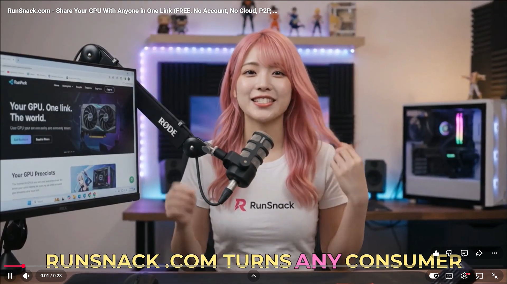

### Your GPU. One link. The world. [Watch our 30-sec YouTube reel:](https://www.youtube.com/watch?v=nP4zvceHLFc)

<div align="center">
  <a href="https://www.youtube.com/watch?v=nP4zvceHLFc">
    
  </a>
</div>

**Share your GPU with anyone, anywhere — no accounts, no cloud, no listings, no middleman.**

RunSnack turns any machine with Docker into a one-link terminal you can hand to a specific person, right now. Not a marketplace, not a rental platform — a direct connection between two people, peer to peer.

📄 [Security model and threat model](https://github.com/PacifAIst/runsnack/blob/main/SECURITY.md) — how the boundaries work and how to configure your setup.

[](https://discord.gg/jaKt2HANNP)
[](https://hub.docker.com/r/gunzfanatic/runsnack-agent)
[](./LICENSE)
[](https://runsnack.com)


---

## Why RunSnack exists

Every GPU marketplace — Vast.ai, SaladCloud, RunPod, Akash — solves the same problem: connect a stranger to *some* GPU, through an account, a listing, and a platform sitting in the middle taking a cut.

That's not the problem RunSnack solves.

RunSnack gets **someone specific** onto **your** hardware, **right now**:

- A student who needs the lab's GPU for twenty minutes.
- A maintainer who needs to reproduce a bug on your Jetson.
- A collaborator who needs the robot in the next building.
- A friend who needs a CUDA box and you happen to have a spare one idling.

No account for them to create. No listing to publish. No marketplace to wait for. Just a link — because the machine is already yours, and the person is already someone you know.

## How it works

1. **Run the installer** on the machine you're sharing (Windows, Linux, or macOS — one script, no config).
2. **Answer three questions**: CPU cores, RAM, an optional access schedule.
3. **Get a link.** Send it to whoever you're sharing with. They paste it in a browser and get a real terminal, inside a sandboxed Docker container, on your machine — nothing installed on their end.

That's the whole flow. First run pulls a ~4 GB image (a few minutes); every session after that starts in seconds.

```bash
# Linux / macOS
chmod +x snackup.sh && ./snackup.sh
```

```powershell
# Windows (PowerShell)
powershell -ExecutionPolicy Bypass -File snackup.ps1
```

## What's in this repository — and what isn't

This repo holds the two installer scripts — `snackup.sh` and `snackup.ps1` — **byte-for-byte the same ones served from [runsnack.com/download](https://runsnack.com/download/)**. Read every line before you run them; that's the point of putting them here.

The scripts themselves are deliberately thin. What they do, in full:

- Check that Docker is installed and running.
- Ask you three questions (CPU, RAM, schedule).
- Pull `gunzfanatic/runsnack-agent` from Docker Hub and start it with a hardened, locked-down set of `docker run` flags (read-only root, all capabilities dropped, non-root user — you can read those flags directly in the script).
- Print the link the container hands back.

Everything past that point — establishing the connection, moving the terminal session across it, keeping it alive, tearing it down cleanly — happens inside the container image, which is **closed source and not part of this repository**. That's a deliberate line: the scripts that touch your shell with elevated intent are fully readable here; the engineering that makes the connection itself work isn't published.

## What makes RunSnack different

- **Zero network required.** Works the moment you install it, with a network of exactly one — you and whoever you send the link to.
- **No account, ever.** Not for the host, not for the person connecting.
- **Nobody takes a cut.** RunSnack charges no fees. If money changes hands, that's a private arrangement between you and the other person.
- **Seconds to first shell**, not minutes of billing setup.
- **Your hardware, your custody.** The host's machine is never handed to a platform — it stays exactly where it is, sandboxed behind a read-only, capability-dropped, non-root Docker container.
- **Runs on anything with Docker** — a Jetson Nano, an old gaming rig, a datacenter card, even CPU-only. Not limited to whatever a marketplace happens to stock.
- **No crypto, no wallet, no token.**

## RunSnack vs. distributed GPU marketplaces

| | **RunSnack** | Vast.ai / TensorDock | SaladCloud | RunPod Community | Akash / io.net / Nosana | CloudJetson |
|---|---|---|---|---|---|---|
| **Core model** | Direct link between two people | Brokered marketplace | Aggregated compute pool | Brokered marketplace | Token-settled permissionless market | Owned fleet, hourly rental |
| **Works with zero network** | ✅ Yes — share with anyone you know | ❌ No — needs listings | ❌ No | ❌ No | ❌ No | N/A |
| **Private / known-party sharing** | ✅ Yes — primary use case | ❌ Not supported | ❌ No | ❌ No | ❌ No | ❌ No |
| **Account / signup** | ✅ None | ❌ Required | ❌ Required | ❌ Required | ⚠️ Wallet required | ❌ Required |
| **Platform takes a cut** | ✅ No | ❌ Yes | ❌ Yes | ❌ Yes | ⚠️ Protocol fees | ❌ Yes (it's the seller) |
| **Time to first shell** | ✅ Seconds — one script | ❌ Minutes + billing setup | ⚠️ Minutes | ⚠️ Minutes | ❌ Minutes + wallet | ⚠️ Minutes |
| **Access method** | ✅ Browser terminal, link only | SSH / API / Jupyter | Container job submission | SSH / API | Container deployment | Remote access to their boxes |
| **Who holds custody** | ✅ Nobody — host keeps their machine | Platform brokers | Platform orchestrates | Platform brokers | Protocol | Provider |
| **Edge & SBC devices (Jetson, Pi)** | ✅ Yes — whatever the host owns | ⚠️ Rare / none | ❌ No | ❌ No | ❌ No | ⚠️ Yes — Orin & Thor only |
| **Hardware breadth** | ✅ Anything that runs Docker | Consumer + datacenter | Consumer GPUs at scale | Consumer + datacenter | Datacenter-leaning | Jetson only |
| **Crypto / token required** | ✅ No | No | No | No | ❌ Yes | No |
| **Reputation system** | Community channel (Discord) | Built-in | Built-in | Built-in | On-chain | N/A |

*Competitor features and pricing change frequently — verify independently before relying on this table. Compiled August 2026.*

## Safety notes — read before sharing

* Sessions run inside a sandboxed Docker container: read-only root filesystem, all Linux capabilities dropped, `no-new-privileges`, non-root user. Whoever you share a link with gets a terminal inside that container, not your host machine.
* Docker is a sandbox, not a hypervisor. Don't share with anyone you wouldn't hand a real (if contained) shell to, and don't run this on a machine with sensitive data you're not willing to isolate behind that boundary.
* **The GPU is the weaker boundary.** RunSnack passes the GPU through whole — no MIG, no vGPU, no partitioning. VRAM isn't reliably zeroed between contexts, so data can leak across sessions with no container escape involved. This isn't vendor-specific and it isn't a config we skipped: consumer GPUs have no partitioning to configure.
* RunSnack doesn't run, monitor, or moderate sessions. There's no escrow, no payments, no SLA — if money changes hands, that's between you and the other person.
* **Read [SECURITY.md](SECURITY.md) before sharing with anyone.** It's the full threat model: what the boundary does, what it doesn't, and how to reduce your exposure.

## Links

- **Website:** [runsnack.com](https://runsnack.com)
- **Docker image:** [hub.docker.com/r/gunzfanatic/runsnack-agent](https://hub.docker.com/r/gunzfanatic/runsnack-agent)
- **Discord** (find/offer GPU time, support): [discord.gg/jaKt2HANNP](https://discord.gg/jaKt2HANNP)
- **Author:** Manuel Herrador, PhD - [github.com/PacifAIst](https://github.com/PacifAIst)

## License

The installer scripts in this repository are released under the [Apache License 2.0](./LICENSE). The RunSnack agent binary and its Docker image remain closed-source and are distributed separately via Docker Hub.

<p align="center">Made with ❤️ for the Local AI Community by PacifAIst</p>

